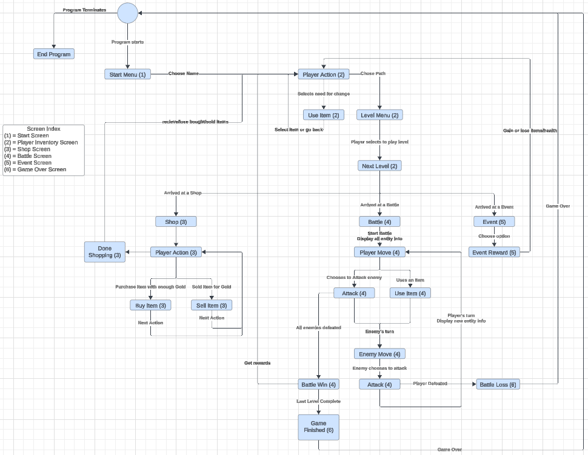
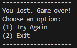
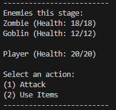
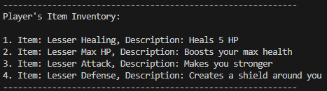
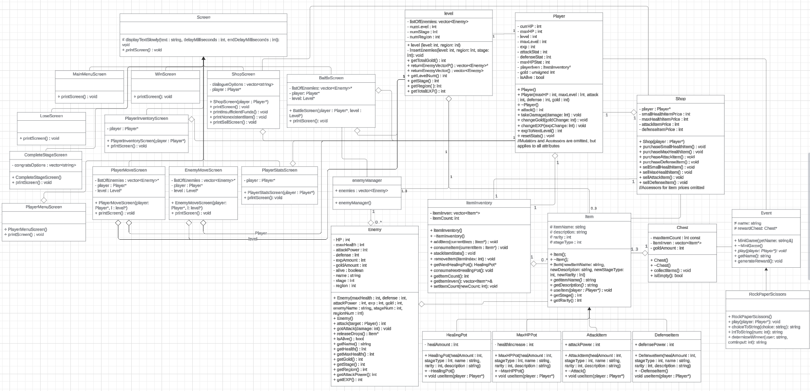

# \<Path of Pain\>
 
  Authors: \<[Josiah Kou](https://github.com/JosiahKou)\>, \<[Glen Bautista](https://github.com/TrainGamer851)\>, \<[Red Su](https://github.com/redddddsu)\>, \<[Sky Huang](https://github.com/kshuang04)\>, \<[Oliver Ren](https://github.com/O1iver-R)\>

## Project Description
  This project is interesting to us because an RPG rouge like is a type of game our members like to play. We want to take insperation from games like Path of Exiles and Slay the Spire. We think an RPG game is a good idea because it allows us to be creative, implementing many different ideas into our game.

 We will be using C++ and VScode for the entirety of our project. We will make everything text based.

 Our project will take in inputs throughout the entirety of the game. Starting the game will immediately put the user in a battle. During the game, it will ask whether the user wants to go a certain path. During battles, the user will be asked what action they want to perform: attack or use an item. All inputs will be selected using a number after being presented a list with numbers. As for outputs, because it is text based, all of the monsters, health, gold, actions, and paths will be shown through text throughout the game. We will output things such as: 
 "Welcome to the game" 
 "Player Health: 100/100" 
 "Enemies in this stage: 
  Zombie (Health: 18/18) 
  Goblin (Health: 12/12)" 
 "Select an action: 
 (1) Attack  
 (2) Items" 
 There will also be special dialouge for events like shopkeepers. They may say: 
 "Hello. Welcome to my shop. 
  (1) Small Health potion  
  (2) Max Health potion 
  (3) Attack potion 
  (4) Defense potion 
  (5) Sell items 
  (6) Leave" 
 As a response, the user will choose a number to purchase anything.

 

 Our project will include the basic features of an RPG. There will be a gold system will be used in shops. There will be a variety of monsters across a few regions that will scale with stage level. There will be a class system that have different base stats. There will be a battle system that allows the use of items and attacking. As for special features, we will have random encounters that will trigger special events and a path system that allows the user to pick what they want to do at every stage. After beating every stage, the player can pick up a random amount of loot.
 
  ## Phase II
  
### Navigation Diagram
 
 The User Navigation Diagram represents the flow of the game iself of how the roguelike game is played and what steps are taken to go from one part to an another. This includes any player inputs or game mechanics to show what things are output in a certain scenario like purchasing items from a shop, fight monsters in a battle, or using items from the player's inventory. It also shows when specific screens are going to be displayed. The "Start Screen" is used to for starting the program or game. The "Player Inventory Screen" is used for the players use items to boost their stats. The "Shop Screen" is used for players to purchase and/or sell items from the Shop in exchange for gold. The "Battle Screen" is used to show the actions from the players and monsters in a fight to see the outcomes. The "Game Over Screen" is used when the game ends from either the player lost or the last level is completed.

### Screen Layouts
The general layout for our screens will consist of details about the current state of the game followed by a user prompt and the choices available for the user to make. The user will then input their choice as numerical input through the terminal.
For example, these are the screens that the user will see at the start and end of the game: 
   
Here, the user is given two choices: start the game (or restart the game) or to exit the game. The user will enter a numerical input to make their choice.

Our battle layout will look like this: 
 
Here, the user is shown information about the enemies' current health as well as their player's current health. The user is also prompted to choose between two actions: attack or use an item they possess. The attack option will decrease the enemies health and start the enemies turn. If the user chooses to use an item, they will be shown the inventory screen which is described in the next section. 

If the user were to want to use an item in battle, they will be greeted with the following screen: 
 
This screen shows the list of items that the player currently has available to use in their inventory. The player is provided with descriptions about each of the items they have. For example, the player has an attack potion in the first slot of their inventory. Additionally, this item has an attack power of 2 which will increase the player's attack power by 2. This screen also gives a brief description about what each item does.

The enemies' turn screen will look like this: 
 
This screen gives information to the user about the enemies' action. There is no user input for this screen. In this case, Enemy 1 attacked Player and Player lost 20 health. After the enemies' turn, if the player survives the attack, the battle screen will be shown again with the new updated health and the choices the user is able to make. 

Finally, another one of our main screens will be the shopkeeper's screen: 
 
This screen follows our general layout. If the user chooses to visit the shopkeeper after completing a level, they will be greeted with this screen that shows how much currency they currently have and the items avaiable to purchase from the shopkeeper. Again, the user is prompted to choose an option and input their choice as a numerical input. If they choose to buy an item, that item will be added to their inventory and the cost of that item will be deducted from their total currency. The user is also given the choice to sell items that they currently have in exchange for currency. Finally, the user is given the choice to leave the shopkeeper and continue their journey through Path of Pain.

### Class Diagram
  

  * The Player class encapsulates the player's attributes and capabilities, such as health, attack power, and available moves. This class interacts with a specialized CharacterClass class, which defines the player’s starting stats, abilities, and moveset.
  * The moveset is further defined by an Attack class, which organizes individual attack moves available to the player.
  * Additionally, each player can possess various items, represented by an Item class. The Item class acts as a parent class for specific item types like health, attack, and defense boosters, allowing for flexible item management and customization.
  * The Enemy class creates enemies that the player will fight against in battles. There will be several different types of enemies with different stats throughout our game.
  * The Level class handles the environment where gameplay events occur. Each level contains a list of enemies which the player will have to fight.
  * Levels may also include rewards, which often consist of items that the player can collect. These items derive from the Item class, linking gameplay rewards with the player’s inventory.
  * The Level class has a reference to the Player class, enabling direct interaction between the player and the game's environment. This reference allows the level to access the player's current state, respond to player actions, and apply changes based on gameplay events. The level can also give rewards to the player. The player also has access to the level, where the player can affect the enemies that are within the level.
  * The Screen class's subclasses are responsible for displaying their respective screens to the terminal. For example, during a battle the BattleScreen class would display its screen which contains information about the enemies' health, the player's health, and the possible actions the player can make.
  * The Shop class is responsible for changing the amount of gold and items in the player's inventory after each transaction.
  
 ### SOLID Principles Applications:
 We applied the Single Responsibility Principle, Open-Closed Principle, and the Dependency Inversion Principle in our class diagram.
 * In order to apply SRP, we created a new class, screen.cpp, that displays all of the screens, information about the player, and information about the level. Initially, these print functions were members of their respective classes. This change helps us right better code because it allows us to purposefully modularize our classes so a single class is not doing all of the work. If a single class does everything, it can get confusing to read and understand. Additionally, when classes have a single responsibility, it becomes easy to locate bugs and make changes.
 * OCP is present in our implementation of the ItemInventory class. ItemInventory follows OCP because it is open for extension, but closed for modification because it stores objects of the base class Item (which all items like health and attack potions will derive from). For example, if we decide to add a new item to our game in the future, let's say a regeneration potion, we do not have to modify the code in ItemInventory because it stores Item object and the regeneration potion item would be a subclass of the Item class. Applying OCP helps us write better code because it allows us to add new features to a program without breaking or modifying existing code. This will also save us time because we would not have to modify/add code in order to have our new features work as intended.
 * We applied DIP in the screen class. The screen class has several subclasses for the different screens our game will have. Our screen class demonstrates DIP because the screen class itself is the high-level module and its subclasses are low-level modules. When we make calls to print a screen, we will make those calls using the screen class so our program will not be looking for a specific type of screen to print. Applying DIP allows us to write better code because, similar to OCP, it allows us to add new features (in our case, new screens) without altering existing code.
 
## Final deliverable
 ## Screenshots

  Starting Game: 
  

  Battle Interaction: 
  

  Checking Player Stats: 
  

  Checking Player Inventory: 
  

  Visiting and purchasing from shop: 
  
  
  Shop Selling interaction: 
  

 ## Installation/Usage
  In order to run the game, after cloning the repo, run `cmake . && make && ./game`
 ## Testing
  We tested our project primarily through unit tests for each class to ensure each class works as intended and works as intended with other classes. When developing and testing classes that needed other classes that were not made yet, we created stubs for those classes.